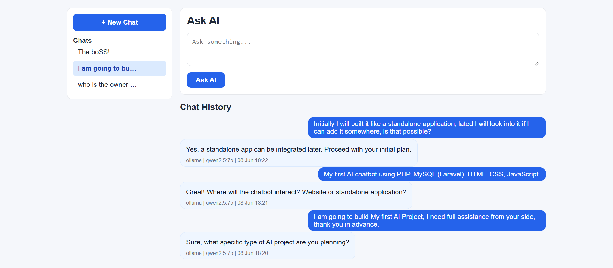
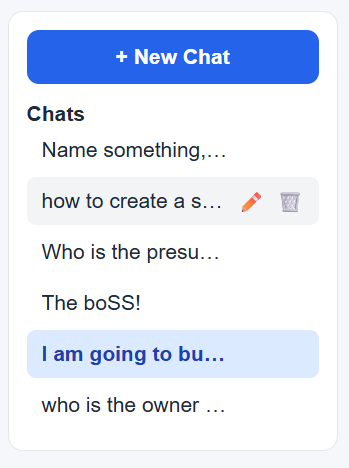
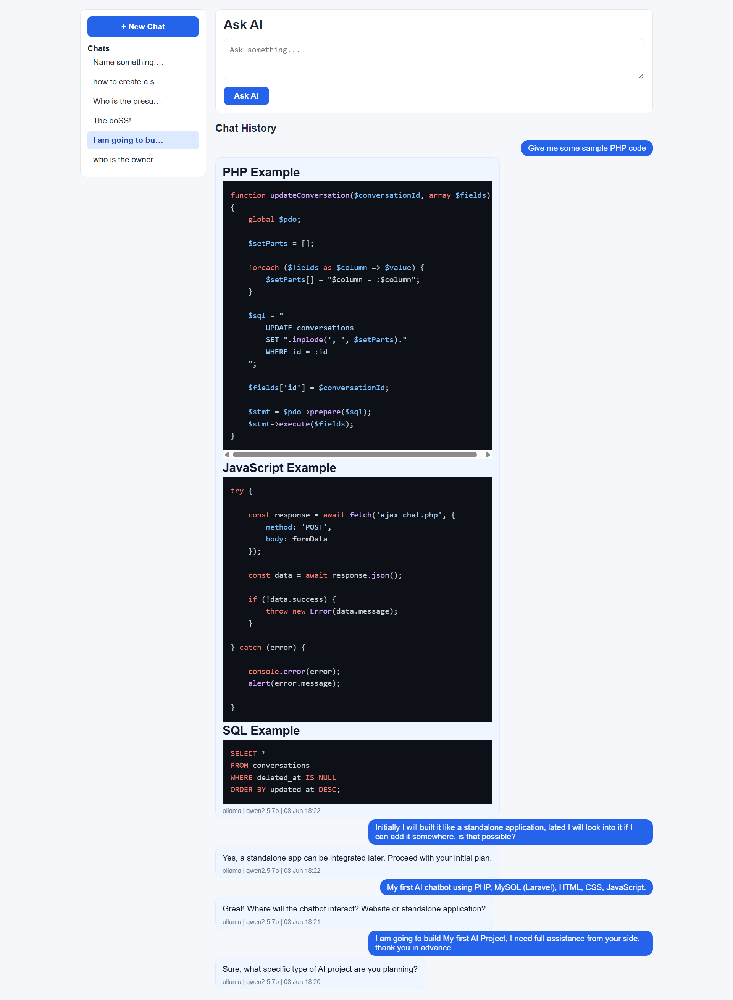

# GSK AI Learning

AI Chat Application built with Core PHP, MySQL, Gemini API and Ollama.

This project was created as a learning journey to understand AI integration, context-aware conversations, software architecture, and modern chat application design before moving to Laravel.

---

## Features

### AI Providers

- Gemini API Integration
- Ollama Local LLM Integration
- Provider Switching

### Chat Features

- AJAX-based Chat Interface
- Context-aware Conversations
- Conversation History
- Markdown Rendering
- Syntax Highlighting
- Response Metadata Tracking
- Error Handling

### Conversation Management

- Multiple Conversations
- Automatic Conversation Titles
- Rename Conversations
- Soft Delete Conversations
- Conversation Ordering by Recent Activity
- Sidebar Navigation

### UI

- Modern Chat Interface
- User and Assistant Chat Bubbles
- Responsive Layout
- Code Block Highlighting

---

## Screenshots

### Main Interface



### Conversation Management



### Code Block Highlighting



---

## Tech Stack

### Backend

- Core PHP
- MySQL
- PDO

### Frontend

- HTML
- CSS
- JavaScript
- AJAX

### AI

- Gemini API
- Ollama

### Libraries

- Parsedown
- Highlight.js

---

## Architecture

```text
User
 ↓
AJAX Request
 ↓
PHP Backend
 ↓
Conversation Context
 ↓
Gemini / Ollama
 ↓
Markdown Rendering
 ↓
Syntax Highlighting
 ↓
Response
```

---

## Project Goal

This project was built to learn:

- AI Integration
- LLM APIs
- Context Management
- Software Architecture
- Database Design
- AJAX Communication
- Code Refactoring
- Conversation Systems

---

## Releases

### v1.0.0 — MVP

- Gemini Integration
- Ollama Integration
- AJAX Chat
- Markdown Rendering
- Syntax Highlighting

### v1.1.0 — Conversation System and UI Improvements

- Conversation Architecture
- Sidebar Navigation
- User/Assistant Chat Interface
- Database Relationship Improvements
- Code Cleanup

### v1.2.0 — Conversation Management Enhancements

- Automatic Conversation Titles
- Rename Conversations
- Soft Delete Conversations
- Recent Activity Sorting
- Generic Conversation Update Helper
- Additional Refactoring

---

## Future Roadmap

- User Authentication
- Multi-user Support
- Knowledge Base Integration
- RAG Implementation
- Laravel Migration

---

## Installation

```bash
git clone https://github.com/mdgsk/gsk-ai-learning.git
```

Install dependencies:

```bash
composer install
```

Create your configuration file:

```text
config.php
```

Configure:

- Database credentials
- Gemini API key
- Ollama settings

Run using:

```text
XAMPP / Apache
```

---

## Author

**Md Gaffar Ali Shaikh**

GitHub:

https://github.com/mdgsk

---

## Status

✅ Core PHP version completed.

The next phase of this learning journey will continue in a separate Laravel project.